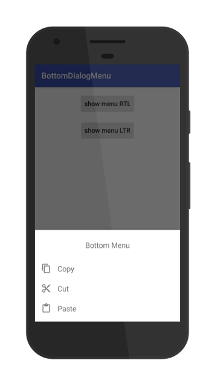
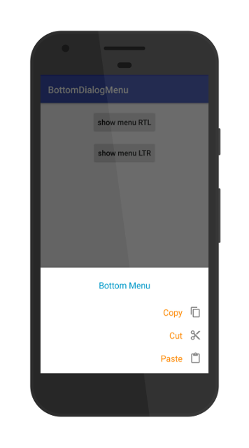

# **BottomDialogMenu**

A customizable Android library to display bottom dialog menu

## **Version**
1.0.0
### **Requirements**

- MIN-SDK Version = 15

### **Installing**
[](https://jitpack.io/#Mojtaba-Shafaei/BottomDialogMenu)

### **Screenshots**





### **Sample code**

```java
BottomDialogMenu dialogMenu = new BottomDialogMenu();
dialogMenu.setDirection(BottomDialogMenu.LAYOUT_DIRECTION_RTL);
dialogMenu.setTitleTextRes(R.string.title);
dialogMenu.setTitleTextColorRes(android.R.color.holo_blue_dark);
dialogMenu.setItemsRes(R.menu.main_menu_rtl);
dialogMenu.setItemTitleColorRes(android.R.color.holo_orange_dark);
dialogMenu.setOnItemClickListener(new View.OnClickListener() {
 @Override
 public void onClick(View view) {
 // do any thing
 }
 });
 dialogMenu.show(getSupportFragmentManager(), "your tag");
```
## **Sample App**
[Download sample app from my drive](https://drive.google.com/file/d/0B7U-LJJvftlSZC1qRDcxeVV3N3M/view?usp=sharing)


## **Developer**

* **Mojtaba Shafaei** [Email](mjtb.shafaei@gmail.com)

## **License**
This project is licensed under the MIT License
